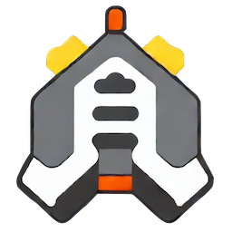
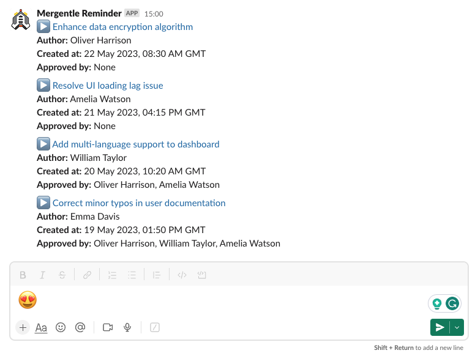

# Mergentle Reminder



Mergentle Reminder is a Slack bot that periodically checks configured GitLab projects and groups for opened merge requests, then sends a summary list of merge requests to review to the configured Slack channel.

The name "Mergentle Reminder" is a playful combination of the words "merge" and "gentle." The name emphasizes the purpose of the project, which is to gently remind the team to review open merge requests.

## Features

- Sends a summary list of merge requests to a Slack channel.
- Supports GitLab projects and groups.
- Filters out draft merge requests.
- Retrieves approvers and additional merge request information.
- Configurable with a YAML file.

## Screenshot



## Configuration

You can configure the Mergentle Reminder bot using a `config.yaml` file. The YAML file allows you to specify GitLab projects, groups, and the GitLab instance URL.

Example `config.yaml`:

```yaml
gitlab:
  url: https://your-gitlab-instance.com
projects:
  - id: 1
  - id: 2
groups:
  - id: 3
```

In addition to the config.yaml file, the following environment variables should be set:

* `GITLAB_TOKEN`: Your GitLab personal access token.
* `SLACK_WEBHOOK_URL`: The webhook URL for the Slack channel where the bot will send messages.
* `CONFIG_PATH` (optional): The path to the config.yaml configuration file. Defaults to config.yaml.

## Building and Running the Application

### Locally

Build the application:

```sh
go build
```

Run the application:

```sh
GITLAB_TOKEN=<your_gitlab_token> SLACK_WEBHOOK_URL=<your_slack_webhook_url> ./mergentle-reminder
```

### Using Docker

Build the Docker image:

```sh
docker build -t your-dockerhub-username/mergentle-reminder:latest .
```

Run the Docker container:

```sh
docker run -e GITLAB_TOKEN=<your_gitlab_token> -e SLACK_WEBHOOK_URL=<your_slack_webhook_url> -v $(pwd)/config.yaml:/config/config.yaml your-dockerhub-username/mergentle-reminder:latest
```

### Deploying to Kubernetes
Create a configmap for the config.yaml file:

```sh
kubectl -n mergentle-reminder create configmap mergentle-reminder-config --from-file=config.yaml
```

Create a secret for the GitLab API token and Slack webhook URL:

```sh
kubectl -n mergentle-reminder create secret generic mergentle-reminder-secrets --from-literal=gitlab-token=<your_gitlab_token> --from-literal=slack-webhook-url=<your_slack_webhook_url>
```

Edit `schedule` in `k8s/cronjob.yaml` to specify the desired schedule. Set to run every hour by default.
See the [CronJob documentation](https://kubernetes.io/docs/concepts/workloads/controllers/cron-jobs/) for more information.

Apply the Kubernetes manifests:

```sh
kubectl apply -f k8s/
```

The application will now run as a CronJob in your Kubernetes cluster, periodically sending reminders to the configured Slack channel.
